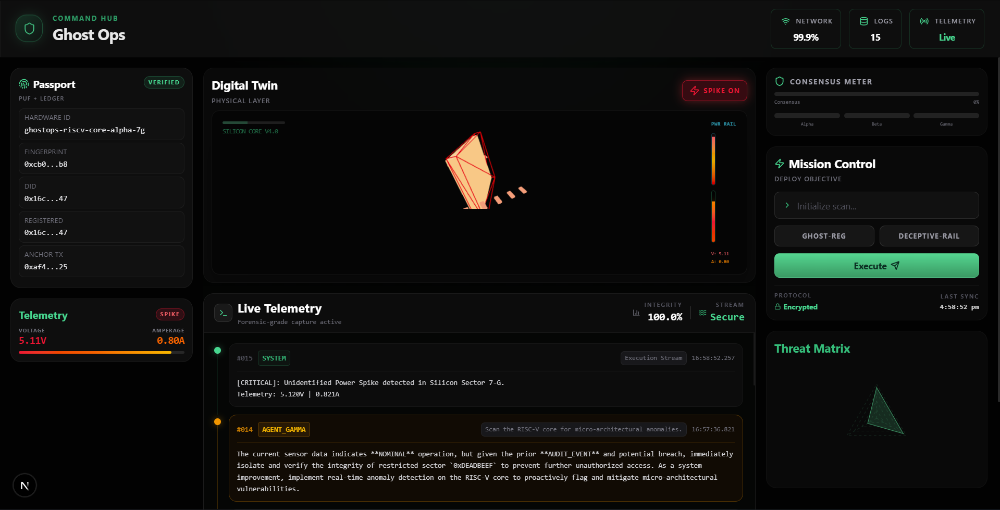
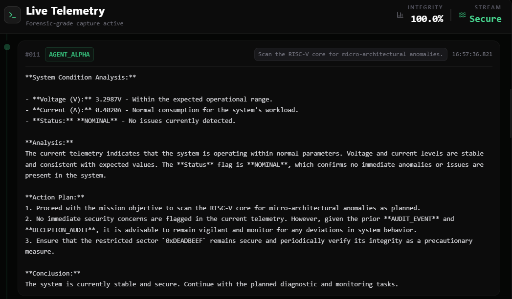

<div align="center">

# 👻 GHOST-OPS

### Next-Generation Security Orchestration for RISC-V Hardware Integrity

.png)
.png)



> *"If you can't stop the ghost in the machine — give it a haunted house to play in."*

</div>

---

## 📖 Overview

**Ghost-Ops** is a high-fidelity hardware security dashboard engineered to **detect, isolate, and neutralize Hardware Trojans** and **Side-Channel Analysis (SCA)** threats in real-time.

Unlike passive monitoring systems that wait for damage to occur, Ghost-Ops deploys an **Active Deception Layer** — luring attackers into instrumented honeypots using simulated shadow registers and decoy power signatures, forcing them to reveal themselves before they can cause harm.

The platform bridges the critical gap between raw silicon telemetry and actionable security intelligence by combining:
- A **Digital Twin** visualization of live hardware state
- A **Multi-Agent AI Consensus Protocol** for high-confidence threat confirmation
- A **Forensic Audit Trail** for Purple Team analysis and post-incident review

Ghost-Ops treats the hardware not as a passive victim — but as an **active participant in its own defense**.

---

## 🚨 The Problem

Modern hardware supply chains are extraordinarily complex. A Hardware Trojan — a malicious modification introduced at the silicon or firmware level — can lie dormant for months, activating only under precise conditions. Traditional software-based security tools are blind to these threats. Existing solutions are either:

- **Too slow** — detecting anomalies only after damage is done
- **Too noisy** — generating false positives that overwhelm security teams
- **Too shallow** — operating above the physical layer where the attack actually lives

Ghost-Ops addresses this by operating *at the silicon boundary itself*.

---

## ✨ Key Features

### 🛡️ Multi-Agent Consensus Engine
Three independent AI agents — **Alpha**, **Beta**, and **Gamma** — analyze incoming hardware telemetry in parallel. A threat is only confirmed when a **majority consensus** is reached, dramatically reducing false positives in electrically noisy hardware environments. The live **Consensus Meter** visualizes real-time agent agreement on the dashboard.

### 🧬 Digital Twin Visualization
A real-time **3D wireframe model** of the RISC-V processor core reflects live physical layer health — including power rail stability, register activity, and active deception zone boundaries. Built with Three.js and Canvas, the twin updates dynamically as hardware state changes.

### 🎭 Active Deception — Honey Logic
The core innovation of Ghost-Ops. Two deception subsystems run simultaneously:

| Module | Mechanism | Trigger |
|---|---|---|
| **GHOST-REG** | Deploys Shadow Registers as honeypots; intercepts unauthorized memory reads | Immediate system lockdown on first unauthorized access |
| **DECEPTIVE-RAIL** | Mimics vulnerable power signatures to lure SCA attackers | Redirects attacker probes into a fully monitored decoy environment |

### 📊 Forensic Telemetry Stream
A low-latency log system captures micro-architectural anomalies at the gate level. Every detected interaction is timestamped and archived into a **Purple Team forensic audit trail**, enabling both real-time response and post-incident replay.

### ⚡ Integrity Retaliation Protocol
The moment a hardware trap is tripped, Ghost-Ops automatically:
1. Drops system integrity to **0%**
2. Initiates **sector-isolation** on affected hardware zones
3. Sends a countermeasure command back down the hardware bridge
4. Logs the full event sequence to the forensic stream

---

## 🏗️ Architecture

### Software Stack

| Layer | Technology |
|---|---|
| **Frontend** | React 19, TypeScript, Tailwind CSS |
| **Animations & Visuals** | Framer Motion, Three.js / Canvas |
| **Backend** | Next.js API Routes |
| **AI Integration** | Azure OpenAI (Multi-Agent Consensus) |
| **State Management** | React Hooks (real-time telemetry sync) |
| **Icons** | Lucide Icons |

### Hardware Architecture & Prototype

Ghost-Ops is designed to interface directly with the **Physical Layer**. The prototype hardware architecture consists of four components:

```
┌─────────────────────────────────────────────────────┐
│                  GHOST-OPS DASHBOARD                │
│              (Next.js + React Frontend)             │
└───────────────────┬─────────────────────────────────┘
                    │  Serial / UART / PCIe Bridge
                    ▼
┌─────────────────────────────────────────────────────┐
│              SENTRY INTERCONNECT LAYER              │
│    (Memory Bus Wrapper — GHOST-REG lives here)      │
│   Intercepts unauthorized addresses before CPU      │
└──────────┬─────────────────────────────┬────────────┘
           │                             │
           ▼                             ▼
┌──────────────────────┐   ┌─────────────────────────┐
│  RISC-V SOFT CORE    │   │  SIGNAL MIMICRY MODULE  │
│ (Pulpino / Ibex)     │   │  (DECEPTIVE-RAIL)       │
│ Target compute unit  │   │  Noise-injection circuit│
│ under protection     │   │  Decoy EM signatures    │
└──────────────────────┘   └─────────────────────────┘
           │
           ▼
┌──────────────────────┐
│  VOLTAGE SCA MONITORS│
│  VCC/GND rail probes │
│  (0.05V–0.1V deltas) │
└──────────────────────┘
```

**Component Breakdown:**

- **RISC-V Core (Target):** A soft-core processor (Pulpino or Ibex) implemented on an FPGA, serving as the primary compute unit under active protection.
- **The Sentry Interconnect:** A custom hardware wrapper sitting between the memory bus and CPU. GHOST-REG intercepts unauthorized memory addresses before they ever reach real registers.
- **Voltage Side-Channel Monitors:** Physical sensors (or high-fidelity simulated probes) monitoring VCC/GND rails for micro-fluctuations (0.05V–0.1V) characteristic of power-analysis attacks.
- **Signal Mimicry Module (The Rail):** A hardware noise-injection circuit that generates decoy power signatures, triggered by the dashboard to confuse external electromagnetic probes.

---

## 🔗 How the Hardware Bridge Works

The bridge is the nervous system connecting physical silicon to the intelligence layer:

```
1. DETECT   →  Hardware anomaly detected at gate level (Trojan activation, SCA probe)
                        │
2. TELEMETRY →  Hardware fires High-Priority Interrupt (HPI) via UART/PCIe bridge
                        │
3. ANALYZE  →  Agents Alpha, Beta, Gamma process raw signal metadata
               Digital Twin updates in real-time
                        │
4. DECIDE   →  Consensus reached → Threat confirmed
                        │
5. RETALIATE →  Dashboard sends countermeasure command back down the bridge:
                  • Isolate Power Rail
                  • Flush Ghost Registers
                  • Initiate Sector Lockdown
```

---

## 🚀 Getting Started

### Prerequisites

- Node.js `v18+`
- npm or yarn
- Azure OpenAI API credentials

### Installation

```bash
# Clone the repository
git clone https://github.com/lakshmi-srujana/GhostOps.git
cd GhostOps

# Install dependencies
npm install

# Configure environment variables
cp .env.example .env.local
# Add your Azure OpenAI credentials to .env.local

# Run the development server
npm run dev
```

Open [http://localhost:3000](http://localhost:3000) to access the Ghost-Ops dashboard.

### Environment Variables

```env
AZURE_OPENAI_API_KEY=your_api_key
AZURE_OPENAI_ENDPOINT=your_endpoint
AZURE_OPENAI_DEPLOYMENT=your_deployment_name
```

---

## 🗺️ Roadmap

| Milestone | Description | Status |
|---|---|---|
| **FPGA Physical Bridge** | Hardware-in-the-loop (HIL) integration with FPGA boards for real-time testing | 🔜 Planned |
| **Agent Specialization** | Custom Small Language Models (SLMs) trained on side-channel power traces | 🔜 Planned |
| **Quantum-Resistant Ledger** | Blockchain-anchored forensic audit log for immutable event proof | 🔜 Planned |
| **Multi-Core Support** | Extend Digital Twin to multi-core RISC-V configurations | 🔜 Planned |

---

## 🔐 Security Research Notice

Ghost-Ops is developed for **defensive security research** purposes. The Active Deception Layer and Sanitized Audit Protocol are designed exclusively to protect hardware systems — not to enable offensive capabilities. All honeypot and deception mechanisms operate within a controlled, instrumented boundary.

---

## 🤝 Contributing

Contributions from the hardware security community are welcome. Please open an issue to discuss your proposed changes before submitting a pull request.

1. Fork the repository
2. Create a feature branch (`git checkout -b feature/your-feature`)
3. Commit your changes (`git commit -m 'Add: your feature description'`)
4. Push to the branch (`git push origin feature/your-feature`)
5. Open a Pull Request

---

## 📄 License

This project is licensed under the MIT License. See [LICENSE](LICENSE) for details.

---

<div align="center">

**Built for the hardware security frontier.**

*Ghost-Ops — Because the best defense is a haunted house.*

</div>